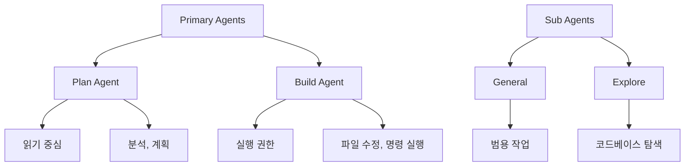
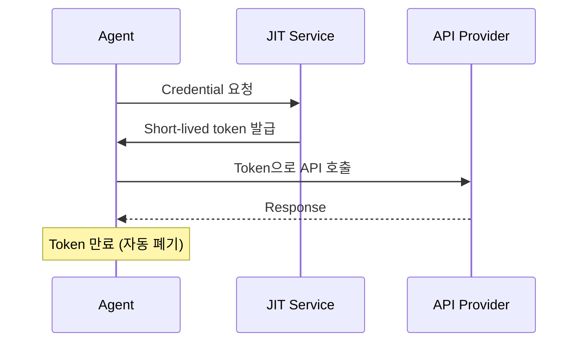

---
tags:
  - open-code
  - coding-agent
  - 워크플로우
  - multi-agent
  - jit-token
date: 2026-03-14
---

# Open Code 2026 실전 워크플로우

조사 일자: 2026-03-14
출처: YouTube 영상 요약
영상: https://youtu.be/UhRGHr7pgnU?si=x_AVtG-l2EbCZe0E

---

## 1. 핵심 요약

**Open Code를 왜 중심 도구로 쓰는가:**
- Terminal TUI, Web GUI, Native App, iPad까지 지원
- "Open Code는 coding agent의 de facto leader"
- 하루 업무의 핵심 도구로 활용

**주요 특징:**
1. **Multi-platform** — Terminal, Web GUI, Native App, iPad
2. **SQLite DB Storage** — Session history, context, model 선택 persist
3. **Agent 모델** — Primary (Plan/Build) + Sub (General/Explore)
4. **Skills** — 설치형 prompt module, 호출 시에만 로드
5. **JIT Token** — Static API key 대신 Just-In-Time short-lived credential
6. **GitHub Integration** — `/OC` comment로 PR review 자동화
7. **Multi-Agent Team** — Team Lead, PM, Backend Dev, Tester, Code Reviewer

---

## 2. 상세 분석

### 2.1 Session & Storage

**SQLite DB 기반:**
```bash
open code db  # DB 명령
```

**저장 위치:**
- `~/.local/share/open-code/` (Linux/macOS)

**저장 내용:**
- Session history
- Context window
- Active model choices
- 검색 가능

**장점:**
- 영속성 보장
- Context 유지
- 검색 가능

---

### 2.2 Agent 모델

**계층 구조:**



**Primary Agents:**
- **Plan Agent** — 읽기 중심, 분석, 계획 수립
- **Build Agent** — 실행 권한, 파일 수정, 명령 실행

**Sub Agents:**
- **General** — 범용 작업
- **Explore** — 코드베이스 탐색, 리서치

**생성 방법:**
```bash
open code agent create
```

**특징:**
- Instruction file로 관리
- Examples, edge-cases, permissions 포함
- Tag로 호출 가능

**장점:**
- Hallucination 감소
- 책임 분리
- 재사용 가능

**단점:**
- Token 소비 증가
- Context fragmentation

---

### 2.3 Skills

**개념:**
- 설치형 prompt module
- 호출 시에만 로드 (context 절약)
- 예: DevOps, Jira, Search, Install

**탐색:**
- `skills.sh` — Curated list
- SkillMP index — Large skill marketplace

**설치:**
```bash
# npx-style
npx open-code-skill install <skill-name>
```

**범위:**
- Global
- Project-specific

**장점:**
- Context window 절약
- On-demand loading
- 커뮤니티 생태계

**주의:**
- Noisy ecosystem
- 품질 편차 큼

---

### 2.4 보안 — JIT Token

**문제:**
- Static API key 저장 위험
- Environment file 노출

**해결 — JIT (Just-In-Time) Token:**


**예시 서비스:**
- Dcope (영상에서 demo)

**특징:**
- Short-lived credential
- 필요할 때만 요청
- 자동 만료

**장점:**
- Static key 노출 방지
- Audit trail
- 세밀한 권한 제어

---

### 2.5 GitHub Integration

**PR Review Flow:**

```mermaid
graph LR
    A[PR 생성] --> B[/OC comment]
    B --> C[Open Code Agent]
    C --> D[Code Review]
    D --> E[Session 생성]
    E --> F[PR Thread에 post]
```

**명령어:**
- `/OC` 또는 `/open code`

**기능:**
- PR comment로 agent 호출
- Review session 자동 생성
- 결과를 PR thread에 post

**Workflow:**
1. PR preview (GH-dash + worktree)
2. `/OC` comment
3. Agent가 코드 분석
4. Review 결과 PR에 게시

**장점:**
- 자동화된 PR review
- CI/CD 통합
- Team collaboration

---

### 2.6 Editor Ergonomics

**Keybinding:**
- `Control-O` — Leader key
- `Control-E` — Neovim으로 prompt 편집

**GUI:**
- Web interface (local server)
- Native app
- iPad support

**노출:**
```bash
# 예: engrop 사용
engrop http://localhost:3000
```

**특징:**
- 원격 접근 가능
- iPad에서 사용
- Notification 지원

**Image Support:**
- Terminal에 image drag & drop
- Agent가 image에서 style/requirement 추출

---

### 2.7 Multi-Agent Team

**구성:**

| Role | Responsibility |
|------|----------------|
| Team Lead | 전체 조율, 우선순위 |
| Product Manager | 요구사항, 스펙 |
| Backend Dev | 구현 |
| Tester | 테스트 작성 |
| Code Reviewer | 리뷰 |

**사용:**
```bash
# Team-based workflow
/team "Build new feature X"
```

**장점:**
- 자동화된 engineering team
- 역할 분담
- Scalable

**단점:**
- 설정 복잡도
- Token 소비
- Thread 관리

---

## 3. Workflow 예시

### 3.1 일일 업무

```bash
# 1. Session 시작
open code

# 2. Plan agent로 분석
/plan "Analyze the authentication module"

# 3. Build agent로 구현
/build "Add OAuth2 support"

# 4. PR review
/OC  # GitHub에서

# 5. Multi-agent team
/team "Complete feature X"
```

---

### 3.2 Maintenance

```bash
# DB 확인
open code db

# Session 검색
open code search "authentication"

# Skill 설치
npx open-code-skill install devops

# Agent 생성
open code agent create my-custom-agent
```

---

## 4. 장단점

### 4.1 장점

1. **Multi-platform** — Terminal, Web, Native, iPad
2. **Hallucination 감소** — Focused agents + skills
3. **PR review 자동화** — GitHub integration
4. **Multi-agent team** — Autonomous engineering team
5. **Security** — JIT token
6. **Flexibility** — Model routing, skills, agents
7. **Persistence** — SQLite DB storage

---

### 4.2 단점

1. **Token 소비 증가** — Multi-agent, sub-agents
2. **유지보수 비용** — Prompt/agent tuning 지속 필요
3. **Rule-breaking 가능성** — Prompt injection 한계
4. **Thread 복잡성** — 다수 sub-agent 관리
5. **Skill ecosystem noise** — 품질 편차
6. **Learning curve** — 설정 복잡도

---

## 5. 결론

### 5.1 Open Code의 위치

> "Open Code는 laptop, web, iPad 어디서든 사용 가능한 flexible, everywhere tool. 큰 feature와 자동화에 강력하지만, 지속적인 설정, short-lived token 보안, 유지보수가 필요."

**De facto leader** — Coding agent 분야의 선도자

---

### 5.2 적합한 사용 시나리오

**✅ 적합:**
- 대규모 feature 개발
- PR review 자동화
- Multi-agent team 운영
- Cross-platform 작업
- 보안 중요 환경 (JIT token)

**❌ 부적합:**
- 단순 작업
- Token 제약 환경
- 설정 오버헤드 회피

---

### 5.3 Best Practices

1. **JIT Token 사용** — Static key 피하기
2. **Agent 분리** — Plan vs Build, General vs Explore
3. **Skills 활용** — On-demand loading으로 context 절약
4. **GitHub Integration** — PR review 자동화
5. **지속적 tuning** — Prompt/agent/skill 유지보수

---

## 6. 참고 자료

### 영상
- **URL:** https://youtu.be/UhRGHr7pgnU?si=x_AVtG-l2EbCZe0E
- **길이:** 19분 16초
- **단어 수:** 3.9k

### 관련 문서
- [[pi-coding-agent-심화가이드|Pi Coding Agent 심화 가이드]] — Pi와의 비교
- [[tycono-분석|Tycono 분석]] — Multi-agent organization

### 링크
- Open Code: https://github.com/opencode-ai
- Skills: https://skills.sh
- JIT Token: Dcope (demo service)

---

_작성자: Hank McCoy_
_조사 방법: YouTube 영상 요약 (summarize skill)_
