---
tags:
  - ai-company
  - tycono
  - multi-agent
  - company-as-code
date: 2026-03-13
---

# Tycono 분석

조사 일자: 2026-03-13

조사 일자: 2026-03-13
프로젝트: seongsu-kang/tycono
목적: AI 조직 시뮬레이터의 핵심 기능, 구현 방식, 기술 스택 분석

---

## 1. 핵심 요약

**Tycono란:**
- Company-as-Code — 코드로 정의하는 AI 조직
- Multi-Agent System — 여러 AI Role이 계층 구조로 협업
- Knowledge Base — 파일 기반 지식 저장 및 축적
- Real-time Visualization — Isometric Office View + Pro Dashboard

**핵심 가치:**
```
IaC (Infrastructure-as-Code) → CaC (Company-as-Code)
.tf       → servers          role.yaml   → org structure
playbook  → config           CLAUDE.md   → operating rules
Dockerfile → containers      skills/     → capabilities
```

**버전:** 0.1.93-beta.1  
**라이선스:** MIT  
**Stars:** 확인 필요 (GitHub)

---

## 2. 핵심 기능

### 2.1 Multi-Agent Organization

**기능:** 여러 AI Role이 계층적 조직 구조로 협업

**구현 방식:**
- `role.yaml`로 각 Role 정의
- Org Tree로 계층 구조 관리
- Authority Validator로 권한 검증
- Recursive Dispatch로 하위 Role 호출

**특징:**
- Role별 scoped authority
- Depth limit (max 3)
- Circular dispatch detection
- Parallel dispatch support

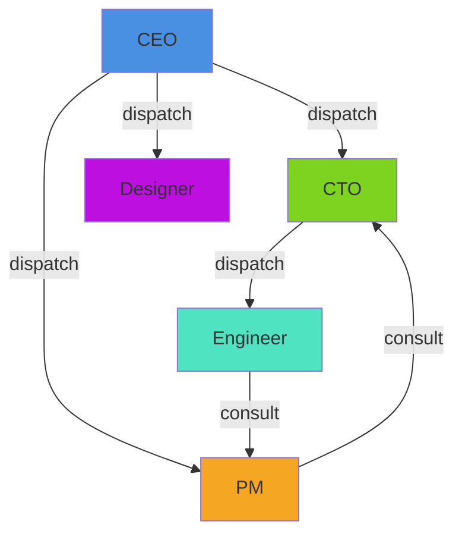

---

### 2.2 CEO Wave — 조직도 기반 작업 분배

**기능:** CEO가 조직도에서 특정 Role을 선택하여 작업 분배

**구현 방식:**
1. Frontend에서 targetRoles 선택
2. `/api/engine/wave` API 호출
3. WaveMultiplexer가 각 Role에 parallel dispatch
4. 각 Role의 Session이 독립적으로 실행
5. 결과를 종합하여 반환

**코드 위치:**
- Frontend: `src/web/src/components/office/WaveCenter.tsx`
- Backend: `src/api/src/services/wave-multiplexer.ts`
- Route: `src/api/src/routes/execute.ts`

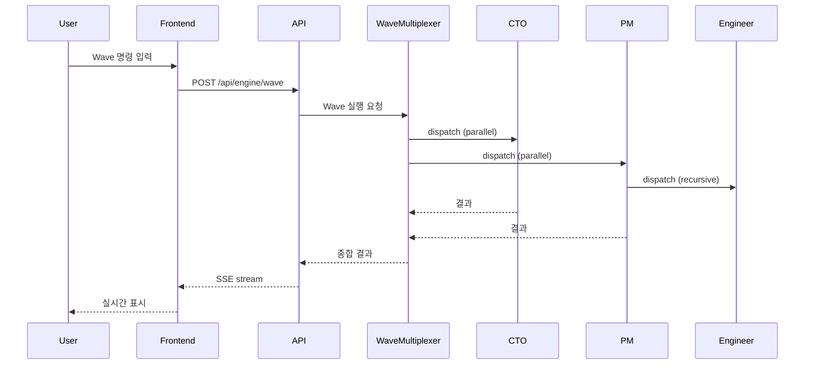

---

### 2.3 Living Knowledge (AKB)

**기능:** 파일 기반 지식 저장, cross-link, 지속적 축적

**구현 방식:**
1. `knowledge/` 디렉토리에 Markdown 파일 저장
2. Context Assembler가 task 관련 문서 탐색 (Pre-Knowledging)
3. Knowledge Gate가 keyword 추출 및 검색
4. Cross-link 지원 (`[[...]]`)

**지식 범위:**
- Company-wide: `company/`, `operations/decisions/`
- Role-specific: `roles/{roleId}/knowledge/`
- Project-specific: `projects/`
- Architecture: `architecture/`

**코드 위치:**
- Assembler: `src/api/src/engine/context-assembler.ts`
- Knowledge Gate: `src/api/src/engine/knowledge-gate.ts`
- Importer: `src/api/src/services/knowledge-importer.ts`

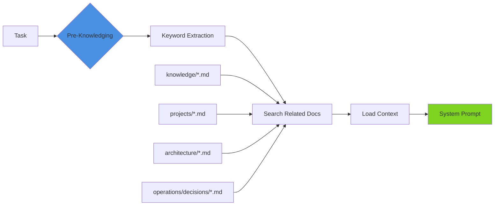

---

### 2.4 Role-Based Authority

**기능:** 각 Role이 scoped authority를 가짐

**구현 방식:**
- `role.yaml`의 `authority` 필드 정의
- Authority Validator가 dispatch/consult 권한 검증
- Org Tree 기반 계층 확인

**권한 유형:**
- `canDispatch` — 하위 Role에게 작업 위임
- `canConsult` — 다른 Role에게 자문 요청
- `knowledgeScope` — 접근 가능한 지식 범위
- `level` — c-level, senior, junior

**코드 위치:**
- Validator: `src/api/src/engine/authority-validator.ts`
- Org Tree: `src/api/src/engine/org-tree.ts`

```yaml
# roles/engineer/role.yaml
id: engineer
title: Engineer
level: junior
reports_to: cto
authority:
  canDispatch: false
  canConsult: [pm, cto]
  knowledgeScope: [engineering, architecture]
```

---

### 2.5 Level System & XP

**기능:** Role이 작업을 완료하면 XP 획득, 레벨 업

**구현 방식:**
- Token Ledger가 작업별 XP 계산
- `preferences.yaml`에 XP/Level 저장
- Level에 따른 accessories unlock

**특징:**
- 작업 완료 시 XP 증가
- Level이 높을수록 경험 많은 Role
- Accessories로 개성 표현

**코드 위치:**
- Token Ledger: `src/api/src/services/token-ledger.ts`
- Preferences: `src/api/src/services/preferences.ts`

---

### 2.6 Office View — Isometric Pixel Art Office

**기능:** AI Role들이 일하는 모습을 isometric 뷰로 시각화

**구현 방식:**
- Canvas 기반 렌더링
- Pixel-art character sprites
- Room별 배치 (Leadership, Engineering, Meeting, Knowledge Library)
- Ambient speech bubbles
- Real-time activity visualization

**기술:**
- React + Canvas
- Sprite Engine (`src/web/src/components/office/sprites/engine/`)
- Furniture Renderer

**코드 위치:**
- TopDownOfficeView: `src/web/src/components/office/TopDownOfficeView.tsx`
- Character Canvas: `src/web/src/components/office/TopDownCharCanvas.tsx`
- Sprites: `src/web/src/components/office/sprites/`

---

### 2.7 Pro View — Slack-style Dashboard

**기능:** 전문적인 대시보드에서 조직 관리

**구현 방식:**
- Wave Center — selective org-tree dispatch
- Chats — 1:1 conversations
- Knowledge Base — graph/tree/list views
- Decisions — CEO 전략 결정 로그

**코드 위치:**
- ProView: `src/web/src/components/pro/ProView.tsx`
- WaveReportCard: `src/web/src/components/pro/WaveReportCard.tsx`

---

### 2.8 Real-time Streaming (SSE)

**기능:** AI 실행 결과를 실시간으로 스트리밍

**구현 방식:**
1. `/api/engine/exec` → SSE connection 생성
2. Agent Loop가 LLM streaming
3. Activity Stream이 이벤트 emit
4. Frontend가 SSE 수신하여 실시간 렌더링

**이벤트 타입:**
- `msg:start`, `msg:done`, `msg:error`
- `text`, `thinking`
- `tool:start`, `tool:result`
- `dispatch:start`, `dispatch:done`

**코드 위치:**
- SSE Route: `src/api/src/routes/execute.ts`
- Activity Stream: `src/api/src/services/activity-stream.ts`

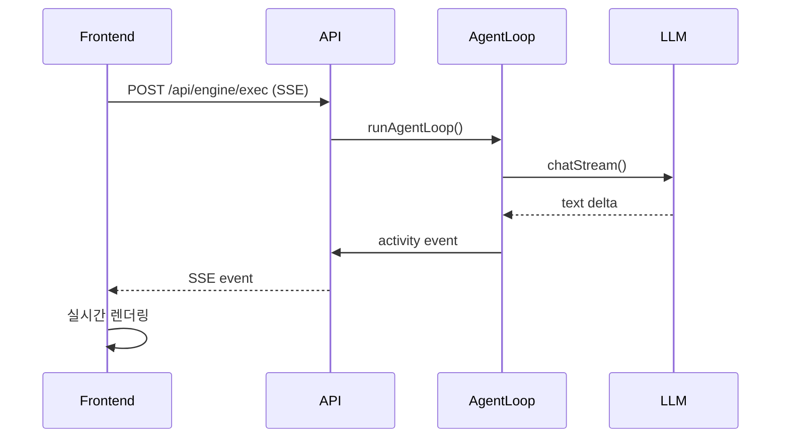

---

### 2.9 Git Integration

**기능:** 작업 결과를 Git에 자동 커밋

**구현 방식:**
- Git Save Service가 변경사항 감지
- Auto-commit with message
- Worktree support for isolation

**코드 위치:**
- Git Save: `src/api/src/services/git-save.ts`

---

### 2.10 Setup Wizard

**기능:** 초기 설정 마법사

**구현 방식:**
1. AI Engine 선택 (Claude API / Claude Max / auto-detect)
2. Company Name 설정
3. Team Template 선택 (Startup / Research / Agency / Custom)
4. Scaffolding — 파일 구조 생성

**코드 위치:**
- Frontend: `src/web/src/pages/OnboardingWizard.tsx`
- Backend: `src/api/src/routes/setup.ts`
- Scaffolder: `src/api/src/services/scaffold.ts`

---

## 3. 기술 스택

### 3.1 Backend

| 기술 | 버전 | 용도 |
|------|------|------|
| **Node.js** | ≥18 | Runtime |
| **Express** | 5.0.1 | HTTP Server |
| **TypeScript** | 5.7.3 | Language |
| **Anthropic SDK** | 0.78.0 | Claude API |
| **YAML** | 2.7.0 | Config parsing |
| **Gray Matter** | 4.0.3 | Frontmatter parsing |
| **Marked** | 15.0.6 | Markdown parsing |
| **Glob** | 11.0.1 | File search |

**Architecture:**
- Express REST API
- SSE (Server-Sent Events) for streaming
- File-based storage (no database)
- tsx for TypeScript execution

---

### 3.2 Frontend

| 기술 | 용도 |
|------|------|
| **React** | UI Framework |
| **TypeScript** | Language |
| **Vite** | Build Tool |
| **Canvas API** | Pixel Art Rendering |
| **Playwright** | E2E Testing |

**Architecture:**
- Single Page Application (SPA)
- React Hooks for state
- Canvas for isometric view
- SSE Client for real-time updates

---

### 3.3 Project Structure

```
tycono/
├── bin/                    # CLI entry
│   ├── cli.js             # Main CLI
│   ├── tycono.ts          # TypeScript CLI
│   └── auth-detect.ts     # Auth detection
├── src/
│   ├── api/               # Backend
│   │   └── src/
│   │       ├── server.ts          # Entry point
│   │       ├── create-app.ts      # Express app
│   │       ├── create-server.ts   # HTTP server
│   │       ├── engine/            # Core engine
│   │       │   ├── agent-loop.ts          # Agent execution
│   │       │   ├── context-assembler.ts   # Prompt assembly
│   │       │   ├── llm-adapter.ts         # LLM abstraction
│   │       │   ├── authority-validator.ts # Permission check
│   │       │   ├── knowledge-gate.ts      # Knowledge search
│   │       │   ├── org-tree.ts            # Organization tree
│   │       │   ├── role-lifecycle.ts      # Role management
│   │       │   └── tools/                 # Tool definitions
│   │       ├── routes/            # API routes
│   │       │   ├── execute.ts     # Execution API
│   │       │   ├── engine.ts      # Engine API
│   │       │   ├── sessions.ts    # Session API
│   │       │   ├── setup.ts       # Setup API
│   │       │   └── ...
│   │       └── services/          # Business logic
│   │           ├── execution-manager.ts   # Execution orchestration
│   │           ├── wave-multiplexer.ts    # Wave dispatch
│   │           ├── activity-stream.ts     # Event stream
│   │           ├── session-store.ts       # Session persistence
│   │           ├── token-ledger.ts        # Token tracking
│   │           └── ...
│   ├── web/                # Frontend
│   │   └── src/
│   │       ├── App.tsx            # App entry
│   │       ├── pages/
│   │       │   ├── OfficePage.tsx
│   │       │   └── OnboardingWizard.tsx
│   │       ├── components/
│   │       │   ├── office/        # Office view
│   │       │   └── pro/           # Pro view
│   │       ├── hooks/
│   │       └── types/
│   └── shared/             # Shared types
│       └── types.ts
├── templates/              # Team templates
│   ├── teams/
│   │   ├── startup.json
│   │   ├── research.json
│   │   └── agency.json
│   └── skills/
├── fixtures/               # Sample company
│   └── sample-company/
│       ├── CLAUDE.md
│       ├── company/
│       ├── roles/
│       ├── projects/
│       ├── knowledge/
│       └── ...
└── package.json
```

---

## 4. 동작 플로우

### 4.1 Startup Flow

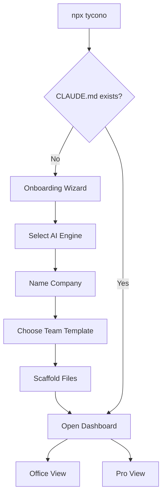

### 4.2 Execution Flow (Single Role)

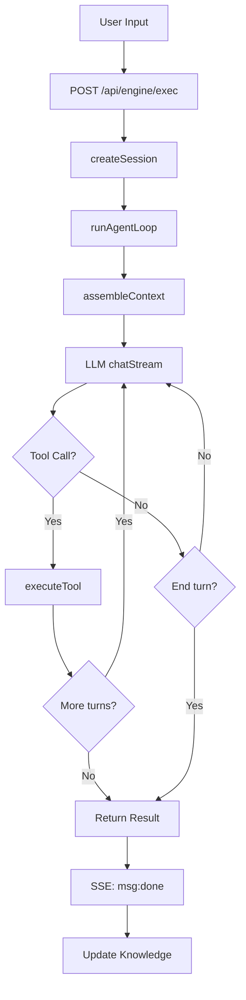

### 4.3 Execution Flow (Wave Dispatch)

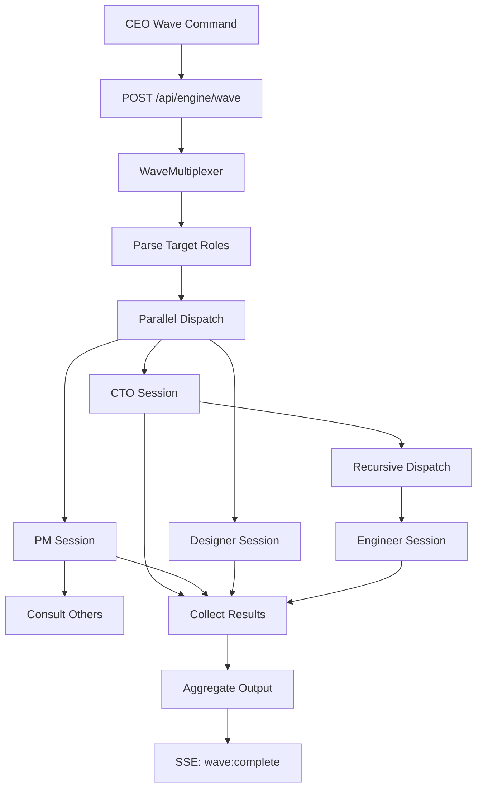

### 4.4 Context Assembly Pipeline

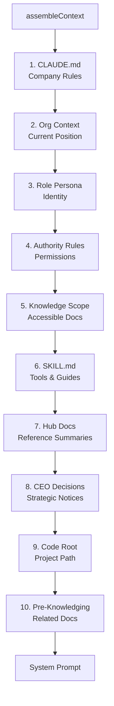

### 4.5 Knowledge Accumulation Flow

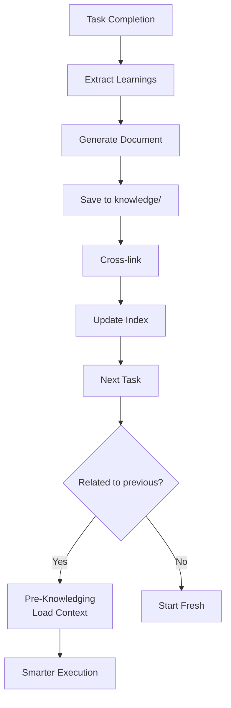

---

## 5. 구현 방식 상세

### 5.1 Agent Loop (agent-loop.ts)

**핵심 로직:**
```typescript
export async function runAgentLoop(config: AgentConfig): Promise<AgentResult> {
  // 1. Context 조립
  const context = assembleContext(companyRoot, roleId, task, sourceRole, orgTree);
  
  // 2. Tools 결정
  const tools = getToolsForRole(hasSubordinates, readOnly, hasBash);
  
  // 3. LLM Streaming
  const response = await llm.chatStream(
    context.systemPrompt,
    messages,
    tools,
    callbacks
  );
  
  // 4. Tool Execution
  for (const block of response.content) {
    if (block.type === 'tool_use') {
      const result = await executeTool(block.name, block.input);
      messages.push({ role: 'user', content: [result] });
    }
  }
  
  // 5. Recursion for dispatch
  if (toolName === 'dispatch') {
    const subResult = await runAgentLoop({
      ...config,
      roleId: targetRoleId,
      depth: depth + 1,
    });
    return subResult.output;
  }
}
```

**특징:**
- Recursive dispatch (max depth 3)
- Circular dispatch detection
- Context compression for long conversations
- Abort signal support

---

### 5.2 Context Assembler (context-assembler.ts)

**9단계 파이프라인:**
1. **Company Rules** — CLAUDE.md, company.md
2. **Org Context** — 현재 Role의 조직도 위치
3. **Role Persona** — identity, personality
4. **Authority Rules** — canDispatch, canConsult
5. **Knowledge Scope** — 접근 가능한 지식 범위
6. **SKILL.md** — Role-specific skills
7. **Hub Docs** — reference summaries
8. **CEO Decisions** — 전사 공지
9. **Pre-Knowledging** — task 관련 문서 자동 로드

**Pre-Knowledging:**
```typescript
// Task에서 keyword 추출
const keywords = extractKeywords(task);

// 관련 문서 검색
const relatedDocs = searchRelatedDocs(keywords, companyRoot);

// System Prompt에 추가
sections.push(buildPreKnowledgingSection(relatedDocs));
```

---

### 5.3 Wave Multiplexer (wave-multiplexer.ts)

**Parallel Dispatch:**
```typescript
export async function runWaveDispatch(config: WaveConfig) {
  const { targetRoles, task } = config;
  
  // Parallel execution
  const promises = targetRoles.map(roleId => 
    runAgentLoop({
      roleId,
      task,
      sourceRole: 'ceo',
      ...
    })
  );
  
  // Wait all
  const results = await Promise.all(promises);
  
  return aggregateResults(results);
}
```

**SSE Multiplexing:**
```typescript
// 각 Session의 이벤트를 single SSE로 multiplexing
for (const session of sessions) {
  session.on('event', (event) => {
    sseClient.send({
      ...event,
      roleId: session.roleId,
    });
  });
}
```

---

### 5.4 Tool Execution

**Available Tools:**
- `dispatch` — 하위 Role에게 작업 위임
- `consult` — 다른 Role에게 자문 요청
- `read_file` — 파일 읽기
- `write_file` — 파일 쓰기
- `bash_execute` — Shell 명령 실행 (codeRoot에서만)
- `create_knowledge` — 지식 문서 생성
- `search_knowledge` — 지식 검색

**Tool Definition:**
```typescript
const TOOLS: ToolDefinition[] = [
  {
    name: 'dispatch',
    description: 'Delegate task to subordinate',
    input_schema: {
      type: 'object',
      properties: {
        role_id: { type: 'string' },
        task: { type: 'string' },
      },
      required: ['role_id', 'task'],
    },
  },
  // ...
];
```

---

## 6. 장단점

### 6.1 장점

1. **Company-as-Code** — 버전 관리, 재현 가능
2. **Multi-Agent Collaboration** — 계층적 협업
3. **Knowledge Accumulation** — 지속적 학습
4. **Authority Scoping** — 명확한 권한 경계
5. **Real-time Visualization** — 직관적인 모니터링
6. **Local-First** — 데이터 프라이버시
7. **BYOK** — 벤더 종속 없음
8. **Open Source** — 커스터마이징 가능

---

### 6.2 단점

1. **Anthropic Only** — 현재 Claude만 지원
2. **File-based Storage** — 대규모에 제약
3. **No Persistence DB** — 세션/토큰 히스토리 제한
4. **Complex Setup** — 초기 설정 필요
5. **Resource Intensive** — Multi-Agent 동시 실행 시 비용

---

### 6.3 개선 가능점

1. **Multi-Provider Support** — OpenAI, Google, Local LLM
2. **Database Integration** — SQLite/PostgreSQL for persistence
3. **Cost Optimization** — Smart caching, model routing
4. **Plugin System** — Custom tools, skills marketplace
5. **Team Collaboration** — Multi-user support

---

## 7. 결론

### 7.1 Tycono의 가치

**단일 AI Agent vs Tycono:**

| 항목 | Single Agent | Tycono |
|------|--------------|--------|
| **Agents** | 1 | Multiple (7→700) |
| **Knowledge** | Session reset | Compounds forever |
| **Authority** | All or nothing | Scoped per role |
| **Delegation** | Manual chaining | Auto routing |
| **Visibility** | Terminal | Office + Dashboard |

**핵심 차별점:**
- 조직 전체를 시뮬레이션
- 파일 기반 영속성
- 권한 경계 강제
- 실시간 시각화

---

### 7.2 적용 시나리오

**적합한 경우:**
1. **Product Development** — PM, CTO, Engineer, Designer 협업
2. **Research Projects** — Lead Researcher, Analyst, Writer
3. **Agency Work** — Creative Director, Designer, Developer
4. **Company Simulation** — 조직 구조 실험

**부적합한 경우:**
1. **Simple Tasks** — 단일 에이전트로 충분
2. **Cost-Sensitive** — Multi-Agent 비용
3. **Real-time Collaboration** — Multi-user 미지원

---

### 7.3 기술적 평가

**잘 설계된 부분:**
- Clean architecture (Engine, Routes, Services)
- Type safety (shared types)
- SSE streaming
- Recursive dispatch
- Context assembly pipeline

**개선 필요 부분:**
- Database persistence
- Multi-provider support
- Cost tracking/optimization
- Plugin system

---

## 8. 참고 자료

### Repository
- GitHub: https://github.com/seongsu-kang/tycono
- Website: https://tycono.ai

### Key Files
- Agent Loop: `src/api/src/engine/agent-loop.ts`
- Context Assembler: `src/api/src/engine/context-assembler.ts`
- Wave Multiplexer: `src/api/src/services/wave-multiplexer.ts`
- Shared Types: `src/shared/types.ts`

### Templates
- Startup: `templates/teams/startup.json`
- Research: `templates/teams/research.json`
- Agency: `templates/teams/agency.json`

---

## 9. Anthropic API 통신 상세

### 9.1 API 통신 구조

Tycono는 Anthropic SDK를 통해 Claude API와 통신합니다.

**Provider 구조:**
```typescript
interface LLMProvider {
  chat(
    systemPrompt: string,
    messages: LLMMessage[],
    tools?: ToolDefinition[],
    signal?: AbortSignal,
    options?: ChatOptions,
  ): Promise<LLMResponse>;

  chatStream?(
    systemPrompt: string,
    messages: LLMMessage[],
    tools: ToolDefinition[] | undefined,
    callbacks: StreamCallbacks,
  ): Promise<LLMResponse>;
}
```

**구현체:**
1. **AnthropicProvider** — Claude API (API key 기반)
2. **ClaudeCliProvider** — Claude CLI (`claude -p`, Claude Max 구독)

---

### 9.2 Streaming 방식

**1. Non-streaming (chat):**
```typescript
const response = await this.client.messages.create({
  model: 'claude-sonnet-4-20250514',
  max_tokens: 8192,
  system: systemPrompt,
  messages: messages,
  tools: tools, // Optional
}, { signal });
```

**2. Streaming (chatStream):**
```typescript
const stream = this.client.messages.stream({
  model: 'claude-sonnet-4-20250514',
  max_tokens: 8192,
  stream: true,
  system: systemPrompt,
  messages: messages,
  tools: tools,
});

// Event handlers
stream.on('text', (text) => {
  callbacks.onText?.(text); // Real-time text delta
});

stream.on('contentBlock', (block) => {
  if (block.type === 'tool_use') {
    callbacks.onToolUse?.({
      id: block.id,
      name: block.name,
      input: block.input,
    });
  }
});

const finalMessage = await stream.finalMessage();
```

**특징:**
- Real-time text streaming (`onText` callback)
- Tool use detection (`onToolUse` callback)
- Abort signal support (사용자 취소)
- Usage tracking (input/output tokens)

---

### 9.3 Tool Calling

**Tool Definition 구조:**
```typescript
interface ToolDefinition {
  name: string;
  description: string;
  input_schema: {
    type: 'object';
    properties: Record<string, unknown>;
    required?: string[];
  };
}
```

**Available Tools:**

| Tool | 설명 | 사용 권한 |
|------|------|----------|
| `read_file` | 파일 읽기 | 모든 Role |
| `list_files` | 디렉토리 파일 목록 | 모든 Role |
| `search_files` | 파일 내용 검색 | 모든 Role |
| `write_file` | 파일 쓰기 | Assign mode |
| `edit_file` | 파일 편집 | Assign mode |
| `dispatch` | 하위 Role 작업 위임 | Manager Role |
| `consult` | 다른 Role 자문 요청 | 모든 Role |
| `bash_execute` | Shell 명령 실행 | codeRoot 있는 Role |

**Tool Execution Flow:**
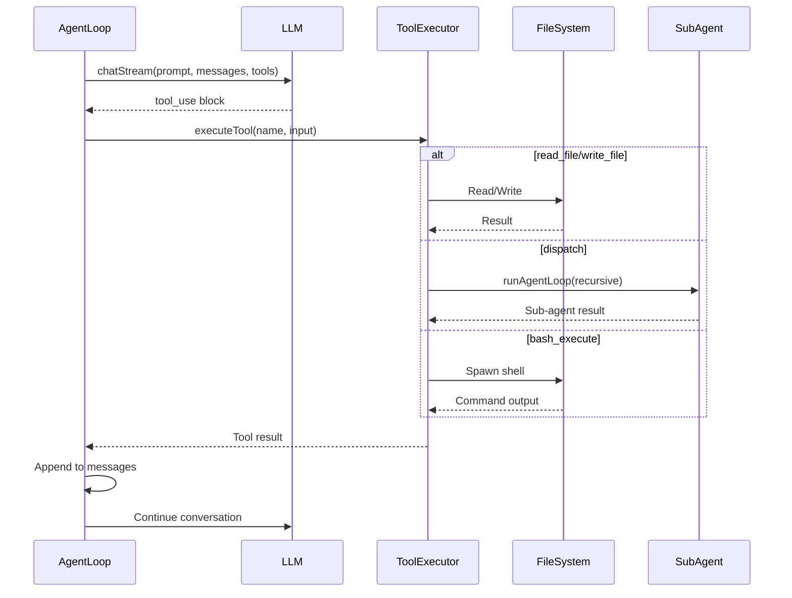

---

### 9.4 Message 구조

**Request:**
```typescript
interface LLMMessage {
  role: 'user' | 'assistant';
  content: string | MessageContent[];
}

type MessageContent =
  | { type: 'text'; text: string }
  | { type: 'tool_use'; id: string; name: string; input: Record<string, unknown> }
  | { type: 'image'; source: { type: 'base64'; media_type: string; data: string } };
```

**Response:**
```typescript
interface LLMResponse {
  content: MessageContent[];
  stopReason: string; // 'end_turn', 'max_tokens', 'stop_sequence', 'tool_use'
  usage: {
    inputTokens: number;
    outputTokens: number;
  };
}
```

---

### 9.5 Claude CLI Provider (Claude Max)

**특징:**
- API key 불필요 (Claude Max 구독)
- `claude -p` CLI 명령 실행
- Tool support (Read, Grep, Glob)
- Simple text output (streaming 없음)

**사용 예시:**
```typescript
const provider = new ClaudeCliProvider();
const response = await provider.chat(
  systemPrompt,
  messages,
  tools,
  signal
);
// response.content = [{ type: 'text', text: '...' }]
```

**CLI Arguments:**
```bash
claude -p \
  --system-prompt "..." \
  --model claude-haiku-4-5-20251001 \
  --max-turns 50 \
  --output-format text \
  --tools Read,Grep,Glob \
  --dangerously-skip-permissions \
  "User message..."
```

---

## 10. Frontend 애니메이션 상세

### 10.1 아키텍처 개요

```mermaid
graph TB
    subgraph Backend
        A[Agent Loop] -->|SSE| B[Activity Stream]
        B -->|events| C[/api/sessions/:id/stream]
    end
    
    subgraph Frontend
        D[useActivityStream Hook] -->|fetch| C
        D -->|events| E[Activity Panel]
        D -->|text| F[Chat Messages]
        
        G[TopDownOfficeView] -->|render| H[Canvas]
        G -->|update| I[Speech Bubbles]
        
        J[Character Canvas] -->|animation| K[Bob Effect]
        J -->|sprites| L[TyconoForge Engine]
        
        M[Event Handlers] -->|hover| N[Dialogue Trigger]
        N -->|show| I
    end
    
    style A fill:#4A90E2
    style D fill:#7ED321
    style G fill:#F5A623
    style J fill:#BD10E0
```

---

### 10.2 Canvas-based Character Animation

**TyconoForge Sprite Engine:**
- **Blueprint 기반 렌더링** — 픽셀 좌표 + 컬러 토큰
- **Layer composition** — body, hair, outfit, accessory
- **Appearance-aware** — 컬러 오버라이드 (hairColor, skinTone, etc.)

**Character Blueprint 구조:**
```typescript
interface CharacterBlueprint {
  id: string;
  width: number;   // 12 (mini), 24 (regular)
  height: number;  // 22 (mini), 44 (regular)
  layers: CharacterLayer[];
}

interface CharacterLayer {
  id: string;
  pixels: Pixel[];
}

interface Pixel {
  x: number;
  y: number;
  w: number;
  h: number;
  c: string;  // Color token (e.g., '$hair', '$skin')
  a?: number; // Alpha (0-1)
}
```

**Rendering Pipeline:**
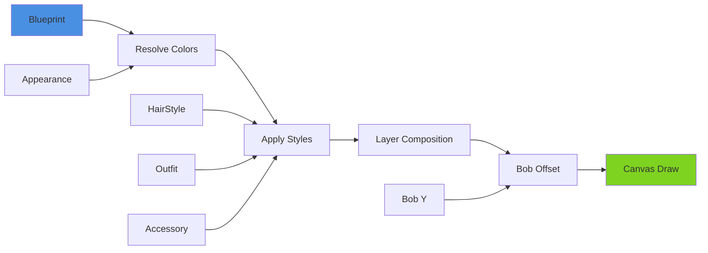

---

### 10.3 Idle Animation (Bob Effect)

**TopDownCharCanvas:**
```typescript
const BOB_PERIOD = 60; // frames
const PHASE_OFFSET: Record<string, number> = {
  cbo: 0, cto: 8, pm: 15, engineer: 22, designer: 5, qa: 12,
};

const tick = () => {
  frameRef.current++;
  
  // Calculate bob offset (0 or 1)
  const cycleFrame = (frameRef.current + phase) % BOB_PERIOD;
  const bobY = cycleFrame < 30 ? 1 : 0;
  
  // Render with bob offset
  ctx.clearRect(0, 0, CW, CH);
  ctx.save();
  ctx.translate(2, 1); // Center blueprint
  renderCharacter(ctx, bp, bobY, appearance, 1);
  ctx.restore();
  
  rafRef.current = requestAnimationFrame(tick);
};
```

**특징:**
- 60-frame cycle (1초 @ 60fps)
- 0-29 frame: bob down (Y=1)
- 30-59 frame: bob up (Y=0)
- Role별 phase offset (동시 밥 방지)

---

### 10.4 Walk Animation

**Walk Frames:**
```typescript
interface WalkFrame {
  direction: WalkDirection; // 'down' | 'up' | 'left' | 'right'
  frame: number; // 0-3
  pixels: Pixel[];
}

const WALK_FRAMES: WalkFrame[] = [
  { direction: 'down', frame: 0, pixels: [...] },
  { direction: 'down', frame: 1, pixels: [...] },
  // ...
];
```

**Animation Logic:**
```typescript
let walkFrame = 0;
const WALK_CYCLE = 8; // frames per walk cycle

const animate = () => {
  const frame = Math.floor(walkFrame / 2) % 4; // 0-3
  const walkData = WALK_FRAMES.find(
    f => f.direction === currentDirection && f.frame === frame
  );
  
  renderPixelsAt(ctx, walkData.pixels, x, y, appearance);
  
  walkFrame++;
  if (walkFrame >= WALK_CYCLE) walkFrame = 0;
  
  requestAnimationFrame(animate);
};
```

---

### 10.5 Speech Bubbles

**상태 관리:**
```typescript
interface HoverState {
  roleId: string;
  hoveredAt: number | null;
  speechDismissTime: number | null;
}

const HOVER_SPEECH_DELAY = 2000; // 2초 hover 시 트리거
const SPEECH_DISMISS_AFTER = 3000; // 3초 후 사라짐
```

**Triggering Logic:**
```typescript
const updateSpeechBubble = (roleId: string, now: number) => {
  const hState = hoverStates[roleId];
  
  // Check if speech should be dismissed
  if (hState.speechDismissTime && now >= hState.speechDismissTime) {
    hState.speechDismissTime = null;
    hideBubble(roleId);
    return;
  }
  
  // Trigger new speech if hovering for 2+ seconds
  if (hState.hoveredAt && !hState.speechDismissTime) {
    const hoverDuration = now - hState.hoveredAt;
    if (hoverDuration >= HOVER_SPEECH_DELAY) {
      const dialogue = getRandomDialogue(roleId, language);
      showBubble(roleId, dialogue);
      hState.speechDismissTime = now + SPEECH_DISMISS_AFTER;
    }
  }
};
```

**Dialogue Sources:**
```typescript
const ROLE_DIALOGUES: Record<string, Record<string, string[]>> = {
  ceo: {
    en: ["Boss?", "What's up?", "Time for a meeting?", ...],
    ko: ["대표님?", "무슨 일이신가요?", "회의 시간이신가요?", ...],
    ja: ["社長?", "何かありますか?", "会議の時間ですか?", ...],
  },
  cto: {
    en: ["Need anything?", "Tech question?", ...],
    ko: ["뭐 필요하신 거 있으세요?", ...],
    ja: ["何かお手伝いしましょうか?", ...],
  },
  // ... other roles
};
```

**Priority:**
1. **Active Task** — Role이 작업 중일 때 표시
2. **Hover Speech** — 2초 hover 시 랜덤 대화
3. **Regular Speech** — API에서 전달받은 speech

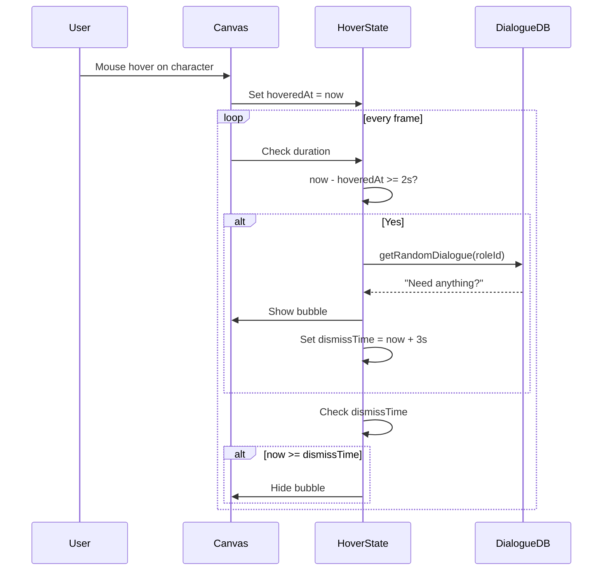

---

### 10.6 Real-time Updates (SSE)

**Backend → Frontend Flow:**

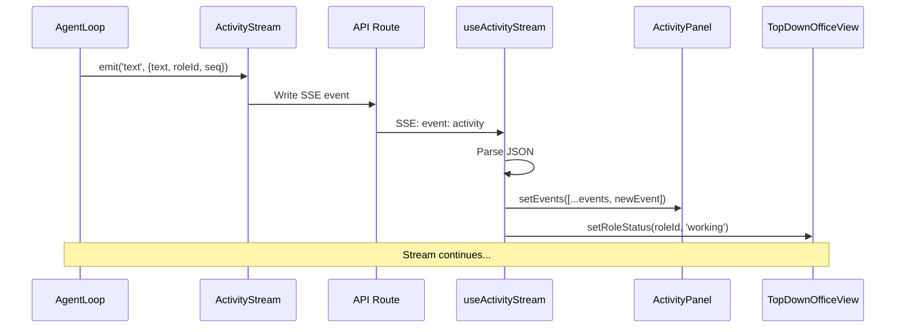

**useActivityStream Hook:**
```typescript
export default function useActivityStream(sessionId: string | null) {
  const [events, setEvents] = useState<ActivityEvent[]>([]);
  const [status, setStatus] = useState<StreamStatus>('idle');
  const [textOutput, setTextOutput] = useState('');
  const [childSessionIds, setChildSessionIds] = useState<string[]>([]);
  
  const connect = useCallback(() => {
    const url = `/api/sessions/${sessionId}/stream?from=${fromSeq}`;
    
    fetch(url, { signal })
      .then(async (response) => {
        const reader = response.body.getReader();
        const decoder = new TextDecoder();
        let buffer = '';
        
        while (true) {
          const { done, value } = await reader.read();
          if (done) break;
          
          buffer += decoder.decode(value, { stream: true });
          const lines = buffer.split('\n');
          buffer = lines.pop() ?? '';
          
          for (const line of lines) {
            if (line.startsWith('event: ')) {
              currentEvent = line.slice(7).trim();
            } else if (line.startsWith('data: ')) {
              const data = JSON.parse(line.slice(6));
              
              if (currentEvent === 'activity') {
                setEvents(prev => [...prev, data]);
                
                if (data.type === 'text') {
                  setTextOutput(prev => prev + data.data.text);
                }
                
                if (data.type === 'dispatch:start') {
                  setChildSessionIds(prev => [...prev, data.data.childSessionId]);
                }
                
                if (data.type === 'msg:done') {
                  setStatus('done');
                }
              }
            }
          }
        }
      });
  }, [sessionId]);
  
  return { events, status, textOutput, childSessionIds };
}
```

---

### 10.7 Activity Event Types

**Event Structure:**
```typescript
interface ActivityEvent {
  seq: number;         // Sequential ID
  ts: string;          // ISO timestamp
  type: ActivityEventType;
  roleId: string;
  parentSessionId?: string;
  traceId?: string;    // Top-level session ID
  data: Record<string, unknown>;
}
```

**Event Types:**

| Type | 설명 | Data |
|------|------|------|
| `msg:start` | Message 시작 | `{sessionId}` |
| `msg:done` | Message 완료 | `{sessionId, totalTokens}` |
| `msg:error` | Message 에러 | `{error}` |
| `text` | 텍스트 스트리밍 | `{text}` |
| `thinking` | Thinking block | `{text}` |
| `tool:start` | Tool 실행 시작 | `{toolName, input}` |
| `tool:result` | Tool 실행 결과 | `{toolName, result}` |
| `dispatch:start` | 하위 Role dispatch | `{targetRoleId, childSessionId}` |
| `dispatch:done` | Dispatch 완료 | `{targetRoleId, result}` |
| `turn:complete` | Turn 완료 | `{turn}` |
| `import:created` | Knowledge import | `{docId, path}` |

---

### 10.8 Animation Performance

**Optimization Techniques:**

1. **RAF (requestAnimationFrame)**
   - 60fps 캐릭터 애니메이션
   - Cleanup on unmount

2. **Canvas Clear + Redraw**
   - Full canvas clear per frame
   - Blueprint render optimization

3. **Phase Offset**
   - Role별 밥 애니메이션 phase 차이
   - 동시 밥 방지 → 자연스러운 움직임

4. **SSE Connection Pooling**
   - Wave dispatch 시 single multiplexed connection
   - Per-role connection 대신 wave-level stream

5. **Event Deduplication**
   - `seq` 기준 중복 이벤트 필터링
   - `lastSeqRef`로 이전 이벤트 추적

---

### 10.9 Mascot Animation (Bichon)

**Mascot Frames:**
```typescript
const MASCOT_FRAMES: Record<MascotDirection, Pixel[][]> = {
  down: [frame0, frame1, frame2, ...],
  up: [...],
  left: [...],
  right: [...],
};

const MASCOT_IDLE_TONGUE: Pixel[] = [...]; // Idle with tongue
const MASCOT_BELLY_UP: Pixel[] = [...];    // Belly rub pose
```

**Behavior:**
- Idle animation (tongue out randomly)
- Follow mouse cursor
- Click to belly rub
- Random walk in office

---

## 11. 통신 및 애니메이션 통합 플로우

### 11.1 End-to-End Flow

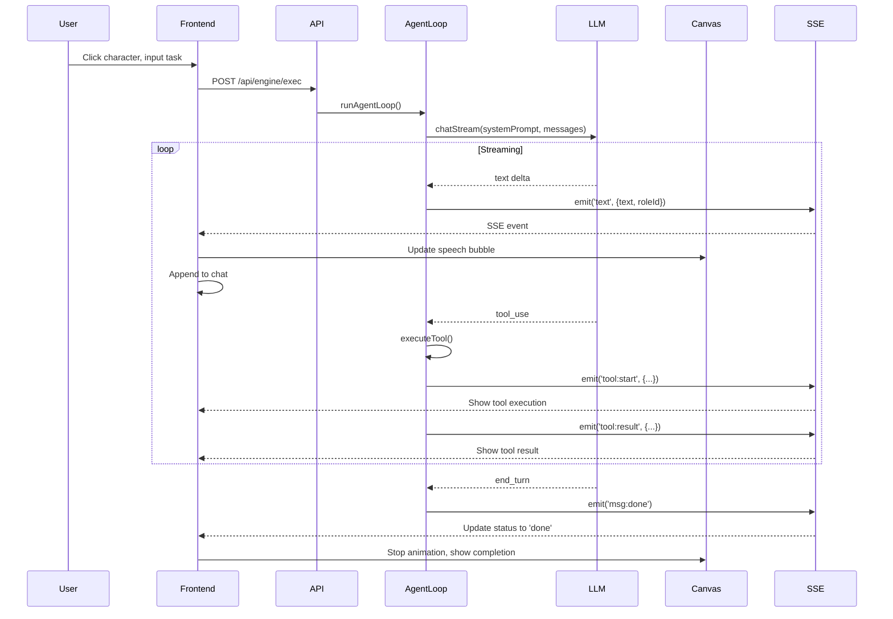

---

### 11.2 State Synchronization

**Backend State:**
```typescript
// Session store
{
  sessionId: {
    id: string;
    roleId: string;
    status: MessageStatus; // 'streaming' | 'done' | 'error' | ...
    events: ActivityEvent[];
    tokens: { input: number; output: number };
    childSessionIds: string[];
  }
}
```

**Frontend State:**
```typescript
// React state
const [roleStatuses, setRoleStatuses] = useState<Record<string, RoleStatus>>({});
const [activeExecs, setActiveExecs] = useState<{roleId, task, id, startedAt}[]>([]);
const [sessions, setSessions] = useState<Session[]>([]);

// Per-session state (via useActivityStream)
const { events, status, textOutput } = useActivityStream(sessionId);
```

**Synchronization:**
1. Backend emits SSE events
2. Frontend hook receives and parses
3. Updates local React state
4. Re-renders affected components

---

### 11.3 Visual Feedback Mapping

| Backend Event | Frontend Action | Visual |
|---------------|----------------|--------|
| `msg:start` | `setRoleStatus(roleId, 'working')` | Character active glow |
| `text` | Append to speech bubble | Real-time text appear |
| `tool:start` | Show in Activity Panel | Tool name + spinner |
| `tool:result` | Show result | Collapse/expand result |
| `dispatch:start` | Add child session | Sub-panel appear |
| `msg:done` | `setRoleStatus(roleId, 'done')` | Glow fade, completion badge |

---

## 12. 요약

### 12.1 Anthropic API 통신

**특징:**
- Streaming 방식 (real-time feedback)
- Tool calling (dispatch, consult, bash, file ops)
- Abort signal (user cancellation)
- Multi-provider (API + Claude Max CLI)

**Message 구조:**
- System prompt (assembled context)
- User/Assistant messages
- Tool use blocks
- Streaming deltas

---

### 12.2 Frontend Animation

**특징:**
- Canvas-based pixel art (TyconoForge)
- 60fps idle animation (bob effect)
- Speech bubbles (hover + active task)
- SSE-driven real-time updates
- Multi-language dialogues

**Performance:**
- RAF-based rendering
- Phase offset for natural movement
- SSE connection pooling
- Event deduplication

---

### 12.3 통합

**End-to-End:**
1. User input → API → AgentLoop → LLM
2. LLM streaming → SSE events → Frontend
3. Frontend → Canvas render → Visual feedback
4. Real-time state sync

---

_작성자: Hank McCoy_  
_분석 방법: 소스코드 직접 분석, README 및 공식 문서_
_업데이트: 2026-03-13 (Anthropic API 통신, Frontend 애니메이션 상세 추가)_
