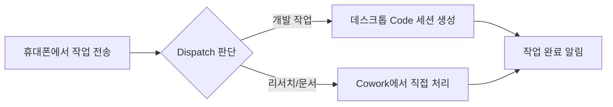

---
tags:
  - 생산성
  - claude-code
  - channel
  - dispatch
  - 원격작업
date: 2026-04-10
---

# Claude Code Channel & Dispatch 기능 정리

조사 일자: 2026-04-10
목적: Claude Code의 외부 연동 및 원격 작업 기능 이해
출처: Claude Code 공식 문서, Anthropic 블로그

---

## 1. 핵심 요약

Claude Code는 외부 시스템과의 연동 및 원격 작업 수행을 위한 두 가지 주요 기능을 제공한다:

| 기능 | 설명 | 방향 |
|------|------|------|
| **Channel** | 외부 이벤트를 Claude Code 세션에 전달하는 MCP 서버 | 단방향 / 양방향 |
| **Dispatch** | 휴대폰에서 작업을 보내면 데스크톱에서 자동 실행 | 양방향 |

**공통 요구사항:**
- Claude Code v2.1.80 이상
- claude.ai Pro 또는 Max 구독 (Channel은 필수)

---

## 2. Channel

### 2.1 개요

Channel은 **외부 시스템과 Claude Code 세션 간의 통신 브리지**로, MCP(Model Context Protocol) 서버로 구현된다. 외부 이벤트(알림, 메시지 등)를 Claude Code 세션에 전달할 수 있다.

> 현재 **Research Preview** 단계

### 2.2 Channel 유형

#### 단방향 (One-way)
외부에서 Claude로 이벤트만 전달:
- CI/CD 빌드 실패 알림
- 모니터링 알림
- Webhook 페이로드

#### 양방향 (Two-way)
Claude가 응답도 보낼 수 있음:
- Telegram 채팅
- Discord 봇
- iMessage 연동

### 2.3 기본 제공 Channel

| Channel | 용도 |
|---------|------|
| **Telegram** | 텔레그램 메시지 수신/발신 |
| **Discord** | 디스코드 봇 연동 |
| **iMessage** | iMessage 연동 |
| **Fakechat** | 테스트/데모용 |

### 2.4 사용 방법

**1단계: `.mcp.json`에 Channel 등록**

```json
{
  "mcpServers": {
    "telegram": {
      "command": "npx",
      "args": ["@anthropic/channel-telegram"]
    }
  }
}
```

**2단계: Claude Code 실행**

```bash
claude --dangerously-load-development-channels server:telegram
```

### 2.5 커스텀 Channel 만들기

`@modelcontextprotocol/sdk`를 사용하여 MCP 서버로 구현한다.

**Webhook 수신기 예시:**

1. `claude/channel` capability를 가진 MCP 서버 생성
2. 로컬 HTTP 포트(예: 8788)에서 수신 대기
3. 요청 도착 시 `notifications/claude/channel` 이벤트 발행
4. `.mcp.json`에 등록

외부에서 이벤트 전송:
```bash
curl -X POST localhost:8788 -d "build failed on main"
```

Claude가 수신하는 형태:
```xml
<channel source="webhook" path="/" method="POST">build failed on main</channel>
```

**양방향 채팅 브리지:**
- 서버 capabilities에 `tools: {}` 선언
- `reply` 도구 핸들러 등록 (`chat_id`, `text` 파라미터)
- Claude가 `reply` 도구를 호출하여 메시지 되돌려 보냄

### 2.6 Permission Relay (v2.1.81+)

Channel을 통해 원격으로 권한 승인이 가능하다:
- `claude/channel/permission` capability 선언
- `notifications/claude/channel/permission_request` 이벤트 처리
- `notifications/claude/channel/permission` 으로 판정 전송

### 2.7 보안 주의사항

- **발신자 ID 기반 게이팅 필수** — 채팅방 ID가 아닌 개별 사용자 ID로 필터링
- 프롬프트 인젝션 방지를 위해 발신자 allowlist 운영 권장
- 기본 제공 Channel들은 발신자 allowlist와 페어링 플로우 내장

---

## 3. Dispatch

### 3.1 개요

Dispatch는 Claude Desktop 앱의 **Cowork 탭**에 있는 기능으로, **휴대폰에서 Claude에게 작업을 보내면 데스크톱의 Claude Code 세션이 자동으로 실행**되어 작업을 수행한다.

### 3.2 작동 방식



1. 휴대폰에서 Claude에게 작업 메시지 전송
2. Dispatch가 작업 유형 판단:
   - **개발 작업** (버그 수정, 테스트, PR 생성 등) → 데스크톱에서 Code 세션 자동 생성
   - **리서치/문서 작업** → Cowork에서 직접 처리
3. 작업 완료 또는 승인 필요 시 푸시 알림 수신

### 3.3 설정 방법

**요구사항:**
- Claude Pro, Max, Team, 또는 Enterprise 구독
- 데스크톱: Claude Desktop 앱 (macOS / Windows)
- 모바일: Claude 앱 (iOS / Android)

**설정 절차:**

1. Claude Desktop 앱에서 **Cowork 탭** 열기
2. 왼쪽 사이드바에서 **"Dispatch"** 클릭
3. **"Get started"** 선택
4. 권한 설정:
   - 파일 접근 허용
   - "Keep computer awake" 활성화
5. **"Finish setup"** 클릭
6. QR 코드 또는 페어링 링크로 휴대폰 연결

### 3.4 실용 예시

**버그 수정:** 외출 중 "React 앱 모바일 뷰 로그인 버튼 수정해줘" → 데스크톱에서 자동 수정 및 PR 생성

**테스트 실행:** "전체 테스트 스위트 실행하고 실패 수정해줘" → 자동 테스트 및 수정

**의존성 업데이트:** "npm 의존성 전부 업데이트하고 빌드 확인해줘" → 자동 업데이트 및 검증

### 3.5 Computer Use 통합

Computer Use를 활성화하면 Dispatch 세션에서 GUI 앱 조작도 가능하다:
- macOS 권한 필요 (Accessibility + Screen Recording)
- **앱 권한은 30분 후 만료** (일반 Code 세션은 세션 동안 유지)

### 3.6 주의사항

- 데스크톱이 **전원 ON + 네트워크 연결** 상태여야 함
- 10분 이상 네트워크 장애 시 세션 타임아웃
- Team/Enterprise는 관리자가 기능을 활성화해야 할 수 있음

---

## 4. 비-Anthropic 모델 사용 시 제약

### 4.1 Channel — 사용 불가

- **claude.ai 로그인 필수** (API 키, Console 인증 미지원)
- Claude 호스팅 인프라에 직접 바인딩되는 구조
- LiteLLM, OpenRouter 등 외부 게이트웨이를 통한 사용 불가

### 4.2 Dispatch — 조건부 사용 가능

LLM 게이트웨이를 통해 비-Anthropic 모델과 함께 사용 가능하지만 추가 설정이 필요하다:

**지원 게이트웨이:**
- LiteLLM
- OpenRouter
- Cloudflare AI Gateway
- Kong AI Gateway

**필요 설정:**
- `settings.json`의 `modelOverrides` 또는 환경변수로 모델 라우팅 구성
- `_SUPPORTED_CAPABILITIES` 환경변수로 기능 선언
- Extended thinking 등의 기능은 수동 설정 필요

### 4.3 요약 표

| 기능 | 비-Anthropic 모델 | 필요 조건 |
|------|:------------------:|-----------|
| **Channel** | 불가 | claude.ai 로그인 + Pro/Max 구독 필수 |
| **Dispatch** | 조건부 가능 | LLM 게이트웨이 + 모델/기능 설정 |

---

## 5. Dispatch vs 다른 원격 기능 비교

| 기능 | 트리거 | 실행 위치 | 최적 용도 |
|------|--------|-----------|-----------|
| **Dispatch** | 휴대폰에서 메시지 | 데스크톱 | 자리 비운 동안 작업 위임 |
| **Remote Control** | `claude remote-control` 실행 | 데스크톱 | 진행 중인 세션을 원격 조종 |
| **Channels** | Telegram/Discord/iMessage 이벤트 | 데스크톱 | 외부 이벤트에 반응 |
| **Claude on Web** | claude.ai/code에서 시작 | Anthropic 클라우드 | 로컬 환경 없이 작업 |

---

_작성자: Claude Code_
_최종 업데이트: 2026-04-10_
