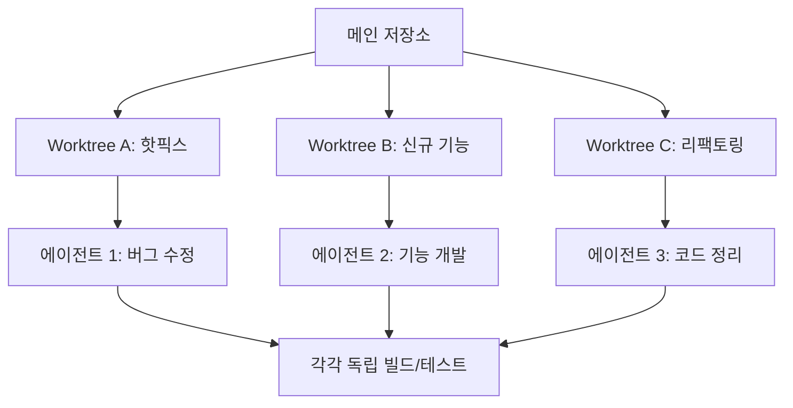
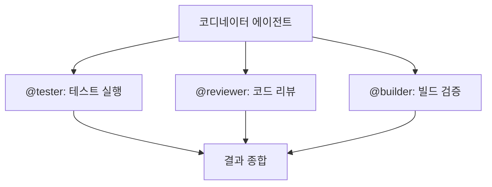
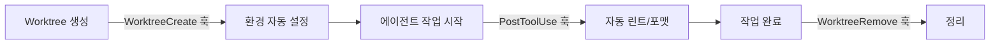

---
tags:
  - 생산성
  - claude-code
  - hooks
  - worktree
  - 자동화
  - 멀티프로젝트
date: 2026-04-10
---

# Claude Code 추천 기능 (2026)

조사 일자: 2026-04-10
목적: 멀티 프로젝트 개발 환경에서 생산성을 높여줄 Claude Code 신규 기능 분석
출처: Claude Code 공식 문서, Changelog

---

## 1. 핵심 요약

Channel/Dispatch 외에 멀티 프로젝트 병렬 작업, QA 자동화, 원격 작업 연속성에 도움이 되는 기능들을 정리한다.

**우선순위 추천:**

| 순위 | 기능 | 이유 |
|:----:|------|------|
| 1 | **Hooks** | 기존 QA/린트 워크플로우와 즉시 통합 가능 |
| 2 | **Worktrees** | 멀티 프로젝트 병렬 작업에 가장 큰 생산성 향상 |
| 3 | **Remote Control** | 이동 중에도 작업 연속성 유지 |
| 4 | **Scheduled Agents** | 반복 작업 자동화로 장기적 시간 절약 |
| 5 | **`/loop`** | 배포/빌드 모니터링에 즉시 활용 가능 |

---

## 2. 상세 분석

### 2.1 Hooks (라이프사이클 훅)

**개요:**
12가지 훅 이벤트를 통해 Claude Code의 동작 전후에 자동화 로직을 삽입할 수 있다. 명시적 제어를 선호하는 워크플로우에 적합하다.

**주요 훅 이벤트:**

| 이벤트 | 시점 | 활용 예시 |
|--------|------|-----------|
| `PostToolUse` | 도구 실행 후 | 파일 수정 후 ESLint/Prettier 자동 실행 |
| `PreToolUse` | 도구 실행 전 | `git push --force` 등 위험 명령 차단 |
| `FileChanged` | 파일 변경 시 | 변경 파일 자동 린트 |
| `UserPromptSubmit` | 프롬프트 제출 시 | 프로젝트 규칙 자동 주입 |
| `SessionStart` | 세션 시작 시 | 환경 변수 자동 설정 |
| `SubagentStart` | 하위 에이전트 시작 시 | 에이전트 컨텍스트 주입 |

**설정 예시:**

```json
// .claude/settings.json
{
  "hooks": {
    "PostToolUse": [{
      "matcher": "Edit|Write",
      "command": "npx eslint --fix $FILE_PATH"
    }],
    "PreToolUse": [{
      "matcher": "Bash",
      "command": "echo '$COMMAND' | grep -q 'push --force' && exit 1 || exit 0"
    }]
  }
}
```

**활용 시나리오:**
- Next.js 마이그레이션에서 파일 수정마다 자동 린트 + 타입 체크
- 실수로 `--force` 푸시하는 것을 사전 차단
- 세션 시작 시 프로젝트별 환경 변수 자동 로드

---

### 2.2 Git Worktrees — 멀티 프로젝트 병렬 작업

**개요:**
독립된 git worktree에서 에이전트가 병렬로 작업하여, 여러 브랜치/프로젝트를 동시에 다룰 수 있다.

**사용법:**

```bash
claude --worktree
```

**핵심 특징:**
- worktree별로 환경 변수, 의존성, 포트 격리
- `WorktreeCreate` / `WorktreeRemove` 훅으로 환경 자동 설정
- 에이전트 간 간섭 없이 독립 작업

**작동 흐름:**



**활용 시나리오:**
- Dashboard에서 핫픽스 작업 중 POS PC 기능 개발 동시 진행
- 한 worktree에서 테스트 돌리면서 다른 worktree에서 코드 작성

---

### 2.3 Remote Control — 세션 이동

**개요:**
터미널에서 시작한 작업을 모바일이나 브라우저로 이어갈 수 있다.

**사용법:**

```bash
claude remote-control
```

**핵심 특징:**
- 터미널 → 모바일 → 브라우저 간 세션 이동
- 세션 상태는 Anthropic 인프라에 E2E 암호화 저장
- 로컬 파일, MCP 서버, 환경 변수는 로컬에 유지
- AI 생성 세션 제목 + 호스트명 표시

**Dispatch와의 차이:**

| 항목 | Remote Control | Dispatch |
|------|---------------|----------|
| 방향 | 진행 중 세션을 원격 조종 | 새 작업을 원격 전송 |
| 세션 | 기존 세션 이어받기 | 새 세션 자동 생성 |
| 적합한 상황 | 작업 도중 이동 | 자리 비운 상태에서 새 작업 시작 |

**활용 시나리오:**
- 사무실에서 Dashboard 리팩토링 시작 → 이동 중 모바일로 진행 상황 확인/승인

---

### 2.4 Scheduled Agents — `/schedule`

**개요:**
cron 스케줄로 Claude Code 에이전트를 자동 실행하는 기능이다.

**사용법:**

```bash
/schedule "매일 오전 9시에 의존성 보안 취약점 점검"
```

**핵심 특징:**
- 클라우드 기반 실행 — 머신 재부팅과 무관
- cron 표현식으로 세밀한 스케줄 관리
- 결과 알림 수신 가능

**활용 시나리오:**
- PayHere MCP 서버 API 상태를 매일 자동 점검
- 주간 의존성 보안 감사 자동 실행
- 매일 아침 각 프로젝트 빌드 상태 요약 보고

---

### 2.5 `/loop` — 반복 모니터링

**개요:**
지정 간격으로 프롬프트를 반복 실행한다.

**사용법:**

```bash
/loop 5m "빌드 상태 확인하고 실패 시 원인 분석해줘"
/loop 10m /simplify   # 다른 slash command도 반복 가능
```

**핵심 특징:**
- 기본 간격: 10분
- 배포 파이프라인, 로그 모니터링에 적합
- 실행 중 다른 작업 병행 가능

**활용 시나리오:**
- 프로덕션 배포 후 5분 간격으로 에러 로그 모니터링
- 장기 빌드 프로세스 완료 감시

---

### 2.6 Claude Code on Web — `claude.ai/code`

**개요:**
로컬 환경 없이 Anthropic 클라우드에서 코드 작업이 가능하다.

**핵심 특징:**
- 브라우저에서 직접 실행
- 브라우저 닫아도 세션 유지
- `/teleport`으로 로컬 터미널로 세션 가져오기 가능

```bash
# 클라우드 세션을 로컬로 가져오기
claude --teleport
```

**활용 시나리오:**
- POC 프로젝트를 외부에서 빠르게 시작 → 나중에 로컬로 이관
- 개발 환경이 없는 기기에서 긴급 코드 리뷰

---

### 2.7 Subagents — 멀티 에이전트 오케스트레이션

**개요:**
여러 에이전트를 동시에 실행하고 조율할 수 있다.

**핵심 특징:**
- 코디네이터 에이전트가 하위 에이전트에 작업 분배
- `/agents`로 실행 중인 에이전트를 탭 형태로 관리
- `@에이전트명`으로 특정 에이전트에 작업 라우팅
- 백그라운드 에이전트가 작업하는 동안 다른 작업 가능



**활용 시나리오:**
- 한 에이전트는 테스트, 다른 에이전트는 코드 리뷰를 동시에 실행
- OpenClaw 에이전트 워크플로우 패턴 참고하여 팀 자동화 구성

---

## 3. 기능 간 조합 활용

### 3.1 Hooks + Worktrees



### 3.2 Scheduled Agents + Channel

- 스케줄 에이전트가 매일 보안 점검 → 결과를 Telegram Channel로 전송
- CI 실패를 Channel로 수신 → 자동 수정 에이전트 트리거

### 3.3 Remote Control + `/loop`

- 장기 배포 중 `/loop`으로 모니터링 설정 → Remote Control로 외출 중 확인

---

## 4. 참고 링크

- [[productivity/claude-code-channel-dispatch|Channel & Dispatch 상세]] — 같은 시리즈 문서
- [Claude Code Hooks 공식 문서](https://code.claude.com/docs/en/hooks)
- [Claude Code Changelog](https://code.claude.com/docs/en/changelog)

---

_작성자: Claude Code_
_최종 업데이트: 2026-04-10_
